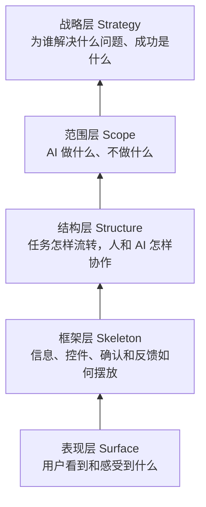
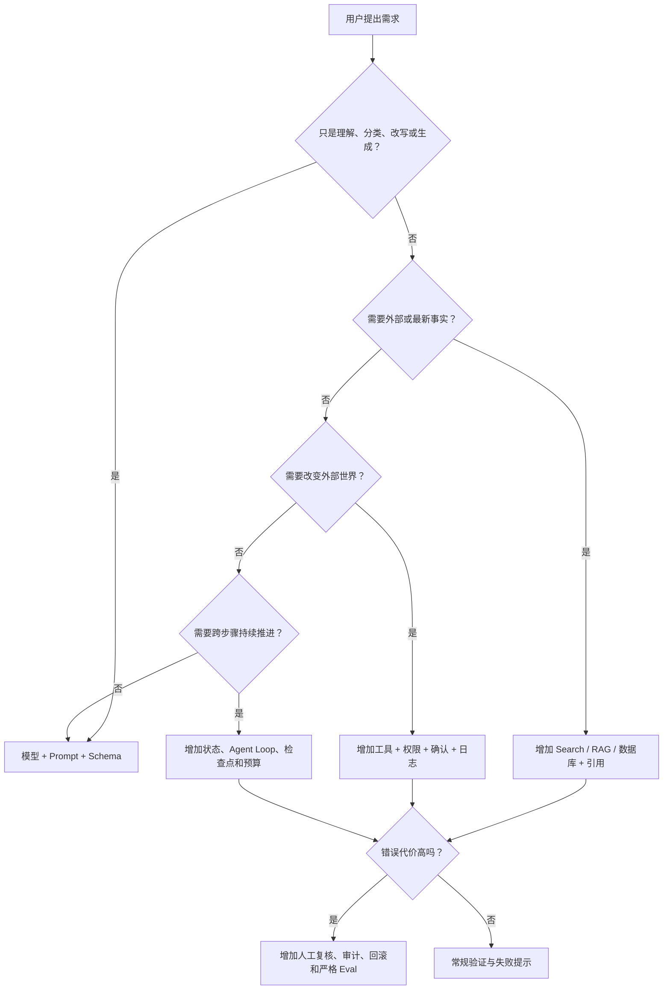
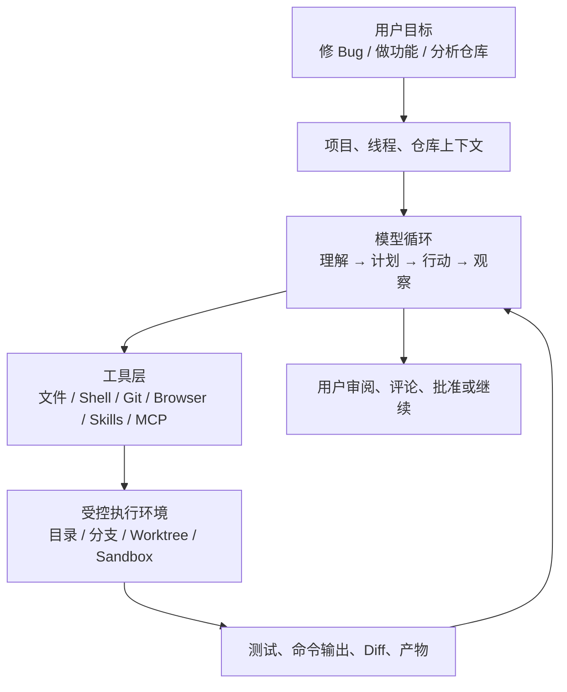
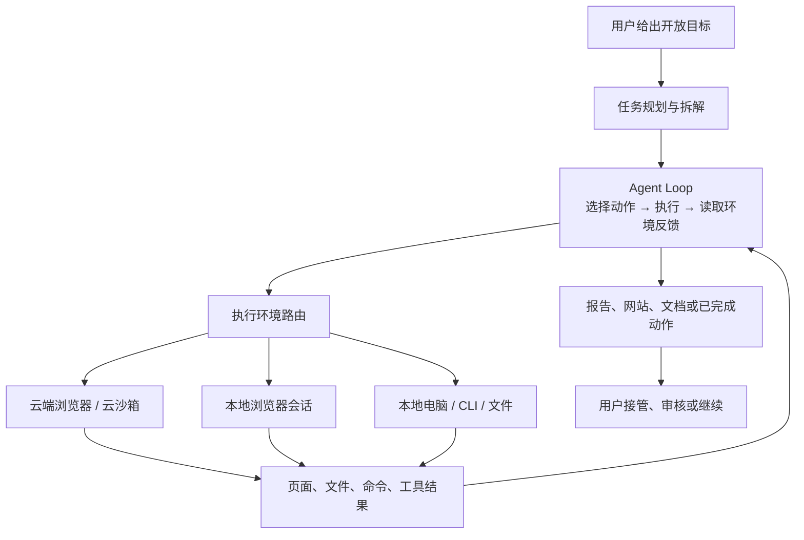
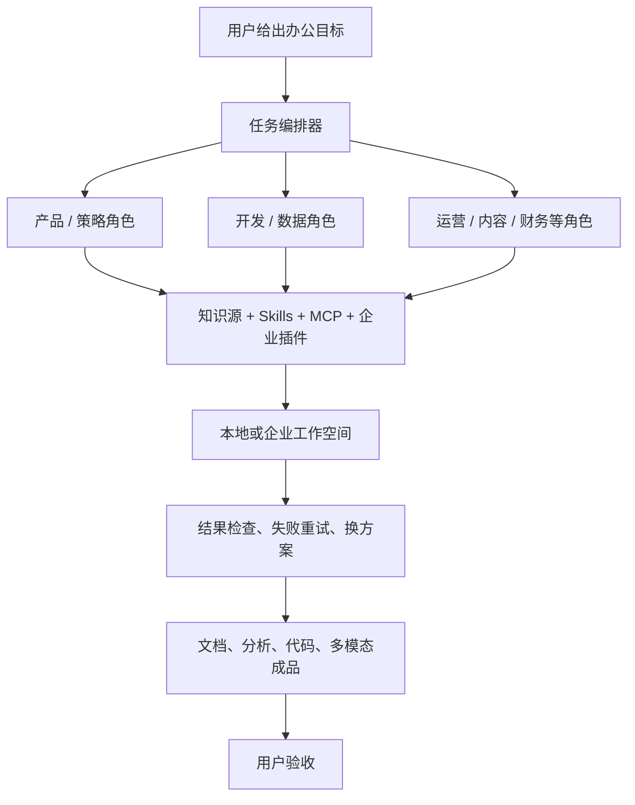
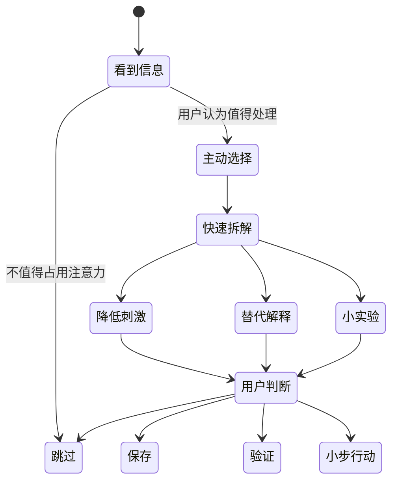

# 从模型能力到 AI 产品架构

> 用“用户体验五要素”理解 Codex、Manus、WorkBuddy 与 Reality Splitter

**适合谁：** 希望从产品经理视角理解 AI，而不是把 AI 当成万能魔法的人。  
**核心目标：** 学会判断一个需求究竟需要模型、上下文、检索、工具、工作流、记忆还是人工确认。

---

## 0. 先记住一条总公式

```text
AI 产品价值
= 模型能力 × 上下文质量 × 工具与数据 × 工作流设计 × 交互控制 × 评测与信任
```

模型很重要，但模型不是完整产品。

大语言模型本质上是一个根据当前上下文预测后续内容的概率模型。训练让它获得了语言、知识模式、推理、分类、改写、代码生成和一定程度的规划能力，但它本身并不天然拥有：

- 当前世界的实时事实；
- 用户电脑、邮箱、数据库的访问权；
- 跨会话可靠记忆；
- 对事实真假的绝对保证；
- 稳定执行长流程的状态机；
- 为错误行动承担责任的能力。

因此：

```text
模型会“生成可能正确的下一步”
产品系统负责“让正确的上下文进入、让动作可执行、让错误可发现、让用户可控制”
```

这也是“聊天模型”和“AI 产品”的本质差别。

---

## 1. 把用户体验五要素升级成 AI 产品框架

Jesse James Garrett 的用户体验五要素从抽象到具体依次是：战略层、范围层、结构层、框架层、表现层。用于 AI 产品时，每一层都需要增加一个“模型与风险问题”。



| 五要素 | 传统产品问题 | AI 产品必须增加的问题 | 主要架构产物 |
|---|---|---|---|
| 战略层 | 用户是谁？解决什么问题？ | 为什么需要 AI？容错率多高？ | 用户任务、价值假设、成功指标、风险等级 |
| 范围层 | 做哪些功能？ | 模型、检索、工具、记忆各负责什么？ | 能力边界、非目标、数据与权限范围 |
| 结构层 | 用户流程怎样组织？ | AI 是一次生成、固定工作流，还是自主循环？ | 任务流、Agent Loop、人工确认点、失败路径 |
| 框架层 | 页面和控件怎么布局？ | 如何展示不确定性、来源、过程、差异和审批？ | 信息架构、操作日志、引用、Diff、Take Over |
| 表现层 | 产品看起来怎样？ | 如何避免把概率输出包装成确定事实？ | 语言语气、置信表达、状态视觉、风险提示 |

### 五要素不是 UI 方法，而是架构方法

很多 AI 团队从范围层直接开工：“加一个聊天框”“接一个模型”“做个 Agent”。正确顺序应该是：

```text
用户任务与失败代价
→ AI 能力合同
→ 人机工作流
→ 控制与反馈界面
→ 视觉和语言
```

如果战略层没回答清楚，模型越强，产品可能只是更昂贵、更不可控。

---

## 2. 模型能力与边界：产品经理的能力地图

### 2.1 模型相对擅长什么

| 能力 | 典型任务 | 适合的产品形态 |
|---|---|---|
| 语义理解与分类 | 意图识别、主题分类、事实/观点分层 | 单次调用、结构化输出 |
| 转换与重写 | 摘要、翻译、降刺激、格式转换 | 嵌入式 Copilot、垂直插件 |
| 开放式生成 | 文案、方案、代码草稿、解释 | 带模板和人工编辑的工作台 |
| 模式归纳 | 从材料中提炼共性、风险、线索 | 研究、分析、审核辅助 |
| 有限推理与规划 | 拆步骤、比较方案、形成初步计划 | 有验证点的工作流或 Agent |
| 调用工具的决策 | 判断何时搜索、运行代码、读取文件 | Agent Loop + 工具协议 |

### 2.2 模型不应该单独承担什么

| 需求 | 模型单独为何不够 | 产品必须补的系统 |
|---|---|---|
| 最新事实 | 参数知识可能过时 | 搜索、数据库、RAG、时间戳与引用 |
| 精确计算 | 语言生成不等于计算器 | 代码执行、计算器、数据库聚合 |
| 用户长期记忆 | 上下文窗口不是可靠记忆库 | 结构化存储、检索、编辑与删除机制 |
| 修改文件或发邮件 | 模型没有天然权限和执行能力 | 工具、权限、沙箱、审批、日志、撤销 |
| 长时间多步任务 | 容易偏航、遗忘目标或循环 | 状态机、检查点、重试、预算与终止条件 |
| 高风险判断 | 可能幻觉，且无法承担后果 | 权威来源、人工复核、审计与责任边界 |
| 稳定一致输出 | 生成具有概率性 | Schema、校验、重试、兜底与 Eval |

### 2.3 一句话判断需求需要什么



---

## 3. 四种常见 AI 产品架构模式

不要用“是不是 Agent”二分所有产品。更成熟的方式是看：任务范围、上下文、工具、自主性、执行环境、验证方式。

### 模式 A：垂直嵌入式工作流——Reality Splitter


**本质：** 把一次高摩擦的 Prompt 操作产品化。  
**优势：** 场景清楚、权限小、输出可评测、风险可控制。  
**边界：** 当前主要基于用户提供的文本分析；没有外部证据时，不能把“证据强度”误写成事实核查结果。  
**适合：** 高频、单点、重复、输出结构稳定的任务。

### 模式 B：有边界的执行 Agent——Codex



官方公开能力显示，Codex 以项目和线程组织任务，能够使用隔离的 worktree 并行工作，借助 Skills 扩展工作流，通过自动化执行重复任务，并使用系统级沙箱限制默认权限。上图是在这些公开能力基础上的**产品参考架构推导**，不是 OpenAI 未公开的内部实现说明。

**本质：** 模型围绕代码和可验证环境循环行动。  
**关键护城河：** 不是“会写代码”，而是上下文获取、工具执行、隔离、测试、Diff 和人工审阅形成闭环。  
**为什么代码场景适合 Agent：** 文件可观察、修改可比较、命令可执行、测试可验证、Git 可回滚。

### 模式 C：通用虚拟电脑 Agent——Manus



Manus 官方将产品描述为拥有虚拟电脑、能规划并交付结果的通用 Agent；其公开文档包含云端沙箱、云浏览器、本地 Browser Operator 和桌面端 My Computer。上图同样是根据公开能力整理的参考架构。

**本质：** 给模型一台可观察、可操作的电脑。  
**优势：** 能覆盖研究、网页操作、文件处理等开放任务。  
**主要难点：** 成功标准模糊、长任务偏航、网页不稳定、登录权限、错误动作和成本累积。

### 模式 D：组织型多角色工作台——WorkBuddy



腾讯云公开页面将 WorkBuddy 定位为“全能 AI 工作台”，强调多专家并行、MCP、自定义 Skills、知识源、电脑和文件操作、自动重试以及企业 VPC。具体内部编排方式没有完全公开，因此图中的“多角色任务编排器”是对其产品心智和公开能力的抽象，而不是对私有技术实现的断言。

**本质：** 用“虚拟专家团队”包装通用 Agent 和企业工具生态。  
**优势：** 更贴近非技术用户的岗位语言和交付物。  
**主要难点：** 多角色可能只是 Prompt 分工；真正价值取决于企业知识、工具接入、权限、交付质量与可审计性。

---

## 4. 用五要素横向比较四个产品

| 五要素 | Codex | Manus | WorkBuddy | Reality Splitter |
|---|---|---|---|---|
| 战略层 | 提高软件和知识工作的交付效率 | 把开放目标委托给虚拟同事 | 让办公用户指挥“专家团”交付成品 | 帮用户在高刺激信息前减速和分层 |
| 范围层 | 仓库、文件、Shell、Git、Skills、工具连接 | 浏览器、云电脑、本地电脑、广泛网页任务 | 文档、知识源、办公工具、MCP、企业插件 | 当前选中文本、四种固定分析模式 |
| 结构层 | 目标 → Agent Loop → 测试/Diff → 审阅 | 目标 → 规划 → 电脑操作 → 交付/接管 | 目标 → 多角色编排 → 重试 → 验收 | 文本 → 模式 → 模型 → 卡片 → 用户判断 |
| 框架层 | 线程、项目、Diff、终端输出、审批 | 任务进度、浏览器画面、Take Over、产物 | 专家角色、任务进度、工作空间、成品 | 页面按钮、浮层/侧栏、结果卡片、设置 |
| 表现层 | 工程化、可审阅、执行导向 | 委托感、虚拟员工感 | 办公协作、专家团队感 | 冷静、低刺激、克制、不做裁判 |

### 决定架构差异的不是模型，而是任务合同

```text
Reality Splitter 的任务合同：
“根据这段文本，给我一个结构化观察，我自己决定。”

Codex 的任务合同：
“在这个工程边界内修改和验证，给我可审阅的 Diff。”

Manus 的任务合同：
“使用一台电脑完成这个开放目标，给我成品。”

WorkBuddy 的任务合同：
“把办公目标分给适当角色和工具，给我可验收的交付物。”
```

所谓“通用”和“垂直”，本质上是任务合同的开放程度不同。

---

## 5. Reality Splitter 的用户体验五要素画布

### 5.1 战略层：不是分析所有信息，而是在关键时刻恢复选择权

**目标用户**

- 信息摄入量大的知识工作者、创作者、创业者；
- 容易被 FOMO、灾难化、身份攀比或冲突叙事牵动的人；
- 愿意主动反思信息，但不想每次复制 Prompt 的人。

**用户问题**

```text
不是“我看不懂这条内容”
而是“它让我很想立刻相信、转发、反击或 all-in，我需要先恢复判断空间”
```

**产品目标**

- 降低从刺激到行动的速度；
- 区分原文、推断和预测；
- 把唯一解释恢复成多个假设；
- 把大动作替换成低成本验证。

**不应该用的北极星指标**

- 用户每天分析的帖子越多越好；
- 用户停留时间越长越好；
- 输出越长越显得聪明。

**更合适的指标**

- 用户是否在真正需要时触发；
- 结果是否让用户发现原本忽略的不确定性；
- 是否减少立即转发、冲动决策或无效深挖；
- 是否产生一个可执行的低成本验证动作；
- 用户是否认为分析简短、克制、有帮助。

### 5.2 范围层：定义能力合同

**MVP 应做**

- 用户主动选择内容；
- 事实、观点、推断、预测和刺激线索分层；
- 中性改写；
- 替代解释；
- 低成本验证建议；
- 明示“不知道”和“仅基于原文”。

**MVP 不做**

- 不自动扫描全部信息流；
- 不诊断用户；
- 不判断作者人格；
- 不在没有外部证据时宣称事实核查；
- 不自动屏蔽、转发或替用户行动；
- 不建立隐蔽的心理画像。

**能力边界表达**

```text
当前模型可以：分析文本中的表达结构和可能性。
当前模型不可以：仅凭原文确认外部世界的真假。
如果未来要核查：必须增加搜索/来源获取、引用、时间戳和证据冲突处理。
```

### 5.3 结构层：采用固定工作流，而不是开放 Agent



这里故意不让 AI 自动决定“保存、屏蔽、相信、反驳或行动”。产品价值是恢复用户的控制，而不是用另一个算法接管注意力。

### 5.4 框架层：界面应帮助判断，不是展示 AI 表演

推荐的信息优先级：

```text
第一屏：原文 + 一句话总体提醒
第二层：事实 / 观点 / 推断 / 预测
第三层：刺激线索 / 证据限制 / 替代解释
行动区：跳过 / 稍后验证 / 做小实验
折叠区：详细说明、模型和来源信息
```

关键控件：

- “仅基于原文”状态；
- “已联网核查 / 未联网核查”状态；
- 用户可选择四种动作，而不是面对空聊天框；
- 错误、超时和证据不足都有独立状态；
- 将来如果引入事实核查，引用必须落到具体结论旁边。

### 5.5 表现层：克制感本身就是功能

**视觉**

- 低饱和色；
- 不用大片红色表达风险；
- 信息分组清晰，但避免评分仪表盘制造伪精确；
- 内容短，默认折叠细节。

**语言**

- 使用“可能、暗示、仅凭原文无法判断”；
- 不使用“你被操控了、危险、有毒、你不理性”；
- 不把模型推断写成心理事实；
- 不用人格化权威口吻代替证据。

---

## 6. 从需求到架构：AI 产品经理七问

每一个新需求进入开发前，都回答下面七个问题。

### 1. 用户任务是什么？

不要写“用 AI 分析内容”，要写用户在什么情境下想完成什么改变。

### 2. 为什么需要模型？

如果规则、搜索、数据库查询就能稳定解决，不必强行使用大模型。

### 3. 模型需要看到什么上下文？

上下文应遵守：最少、相关、可授权、可追溯。

### 4. 需要哪些外部能力？

区分：

```text
模型知识 ≠ 最新事实
生成文本 ≠ 执行动作
上下文窗口 ≠ 长期记忆
模型推理 ≠ 精确计算
```

### 5. 输出合同是什么？

定义 Schema、长度、允许的不确定性、禁止内容以及空结果怎样表达。

### 6. 谁验证、如何恢复？

用户审核、自动测试、来源引用、Diff、撤销、重试、降级分别适用于什么结果？

### 7. 怎样证明它变好了？

先定义 Eval，再换 Prompt 或模型。至少记录：正确性、完整性、克制程度、延迟、失败率、Token 和费用。

---

## 7. AI 架构选择矩阵

| 任务特征 | 推荐架构 | 示例 |
|---|---|---|
| 低风险、固定输入、固定输出 | 单次模型调用 + Schema | 分类、改写、Reality Splitter 快速模式 |
| 需要私有材料，但不行动 | RAG / 文件检索 + 生成 | 企业问答、合同检索 |
| 需要最新信息 | 搜索/数据库工具 + 引用 | 新闻研究、事实核查 |
| 多步骤但路径基本固定 | Workflow / 状态机 | 报销审核、内容生产流水线 |
| 路径不固定，工具可验证 | Agent Loop + Sandbox | Codex 工程任务 |
| 开放目标、跨网页/应用 | Computer Agent + Take Over | Manus 式委托 |
| 多岗位、企业知识和权限 | Orchestrator + Skills/MCP + Governance | WorkBuddy 式办公工作台 |
| 高风险外部动作 | 上述架构 + 强制人工确认、审计、回滚 | 支付、发布、医疗/法律关键决定 |

**原则：选择满足需求的最低自主性。** 自主性越高，演示越惊艳，但成本、失败面、权限风险和评测难度都会上升。

---

## 8. 产品经理怎样识别“AI 什么都能做”的误区

### 误区 1：模型回答过一次，就等于能力稳定

一次成功是 Demo；在不同输入、模型版本和网络状态下仍然稳定，才是产品能力。

### 误区 2：模型知道很多，就等于知道当前事实

知识记忆、搜索结果和权威证据是三回事。

### 误区 3：能规划，就等于能完成

完成任务还需要工具可用、权限足够、环境稳定、错误可恢复、结果可验证。

### 误区 4：加长期记忆，产品就更懂用户

错误记忆和过度收集会降低质量并增加隐私风险。记忆首先应是用户可见、可编辑、可删除的数据产品。

### 误区 5：多 Agent 一定优于单 Agent

多 Agent 增加沟通、Token、延迟和错误传播。只有任务确实可并行、角色输入输出清楚、结果能汇总验证时才有价值。

### 误区 6：更大的模型会自动修复产品问题

错误上下文、模糊目标、缺少工具、糟糕交互和没有 Eval，不会因为模型更大就消失。

---

## 9. 建议用 Reality Splitter 完成的学习路线

### 第一阶段：垂直 AI Workflow

- 完善 Context → Prompt → Schema → UI 闭环；
- 建立 30–50 条固定 Eval 样本；
- 比较模型、Prompt 版本、延迟和成本；
- 区分模型输出与启发式兜底的来源。

### 第二阶段：增加“有来源的能力”

- 只对用户主动要求的内容联网检索；
- 把 Claim、Evidence、Source、Timestamp 建成数据结构；
- 明确“文本分析”和“外部核查”两个模式；
- 研究证据冲突和来源质量，而不是只生成一个真假标签。

### 第三阶段：增加轻量个性化

- 只记输出长度、常用模式和信息领域等产品偏好；
- 让用户查看、编辑和删除；
- 不建立隐蔽心理画像；
- 用 A/B 或 Eval 证明个性化确实改善结果。

### 第四阶段：最后才考虑 Agent

只有当用户真的需要“自动寻找来源 → 比较 → 生成验证卡片 → 保存/提醒”时，才引入工具选择、状态、重试和确认点。

Reality Splitter 不需要为了显得先进而变成 Manus。它可以通过更好的任务合同、Eval 和信息设计，成为比通用 Agent 更可靠的垂直产品。

---

## 10. 最终心智模型

```text
模型决定能力上限，
上下文决定它看见什么，
工具决定它能做什么，
工作流决定它怎样持续做，
界面决定用户怎样理解和控制，
评测与治理决定产品能否被长期信任。
```

作为产品经理，你不需要先学会训练模型。你首先需要学会给需求分型：

```text
这是语言问题、知识问题、数据问题、执行问题、记忆问题，还是责任问题？
```

分型正确，才知道应该使用 Prompt、RAG、工具、Agent、工作流、人工审核中的哪一种。AI 赋能需求的核心，不是把所有流程都改成聊天，而是把模型放在它真正擅长、失败又可控的位置。

---

## 资料来源与说明

产品内部架构通常不会完整公开。本文中产品能力来自官方公开资料，架构图属于根据公开能力做出的产品级抽象，不代表未公开的内部实现。

- OpenAI, [Introducing the Codex app](https://openai.com/index/introducing-the-codex-app/)：项目线程、并行 Agent、worktree、Skills、Automations、沙箱和审阅流程。
- Manus, [Welcome](https://manus.im/docs/introduction/welcome)：虚拟电脑、规划、执行与完整交付。
- Manus, [Cloud Browser](https://manus.im/docs/features/cloud-browser)：云端浏览器、登录会话、多步网页操作和 Take Over。
- Manus, [Browser Operator](https://manus.im/docs/features/browser-operator)：本地浏览器会话、授权、日志与中止控制。
- Manus, [Desktop](https://manus.im/docs/features/desktop)：本地文件、CLI、应用和文件夹授权。
- 腾讯云, [WorkBuddy](https://cloud.tencent.com/act/pro/workbuddy)：全能 AI 工作台、多专家、MCP、Skills、知识源、自动重试和企业 VPC。

文档日期：2026-07-14。
