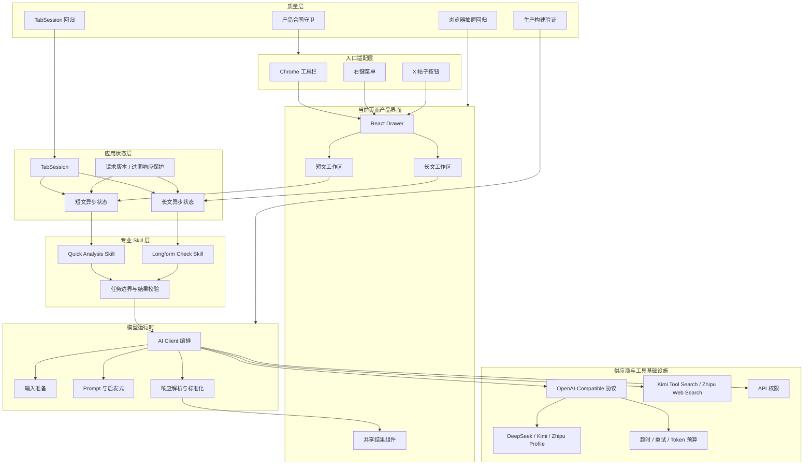

# Reality Splitter 产品与技术架构

> 版本：0.3.1
> 状态：V0 稳定化完成，开始进入 V1 质量建设
> 原则：先让一个信息处理工作流稳定，再增加新能力。

## 1. 产品定位

Reality Splitter 不是通用 Agent，也不是事实裁判。

它是一个由用户主动触发的浏览器内信息减速工具：

```text
用户看到一段内容
→ 主动发送到短文或长文工作区
→ 系统按照固定方法拆解
→ 展示结构化结果与不确定性
→ 用户决定跳过、验证、保存或行动
```

当前只有两个一级任务：

| 工作区 | 用户问题 | 产品交付 |
|---|---|---|
| 短文模式 | 这段话在说什么，它怎样影响我的注意力？ | 事实、观点、推断、预测、刺激机制、证据限制和低成本下一步 |
| 长文模式 | 这篇内容提出了哪些事实与观点，有什么证据？ | 可核查主张、观点、证据说明和来源提示 |

`降低刺激`、`找替代解释`、`转成小实验`目前保留为短文动作。进入 V1 后，它们应逐步成为核心拆解结果之后的后续动作，而不是继续扩张成三个独立产品。

## 2. 不可破坏的产品合同

机器可检查版本位于 `src/contracts/product.ts`。

```text
1. 只有用户点击分析按钮后才调用模型。
2. 页面抽屉是主界面，Chrome Side Panel 只作注入失败时的降级。
3. 每个标签页拥有自己的会话，不使用全局 Storage 驱动主抽屉。
4. 短文和长文拥有独立输入、结果、错误、加载和请求状态。
5. 切换工作区不能清除另一个工作区的结果。
6. 新输入只能重置当前工作区。
7. 过期模型响应不能覆盖用户已经修改的输入。
8. X 可以注入帖子按钮；微博和普通网页永不注入帖子按钮。
9. 模型配置只在独立后台管理。
10. 没有外部证据时，文本分析不能包装成事实核查。
```

## 3. 产品与技术协同图



这张图的关键不是层数，而是每类变化只有一个归属：

```text
入口变化 → extension/entries
页面交互变化 → extension/drawer
标签页状态变化 → application/session
专业分析方法变化 → skills
模型协议变化 → infrastructure/models
搜索工具变化 → infrastructure/search
共享数据合同变化 → contracts / shared/types
```

## 4. 一次请求怎样运行

### 4.1 右键发送到短文

```text
用户选中文字
→ contextMenuEntry 生成 TweetInput
→ openAnalysisSurface 向当前标签页发送 V10 协议
→ Content Script 打开 React Drawer
→ TabSession 只更新 quick.input
→ 用户点击“拆解”
→ Drawer 发送 RUN_INLINE_ANALYSIS
→ Service Worker 调用 Quick Analysis Skill
→ AI Client 调用模型并标准化结果
→ Skill 校验 mode 和 result
→ TabSession 接收仍然有效的请求结果
→ 共享 AnalysisPanel 渲染
```

打开工作区时不会触发模型请求。

### 4.2 长文与短文并行

```text
quick.requestId = 7，正在分析
→ 用户切换 longform
→ longform.requestId = 3，开始核查
→ quick 和 longform 同时 loading
→ quick 先返回，只更新 quick.response
→ longform 后返回，只更新 longform.response
→ 用户切换工作区，两边结果都保留
```

每次输入变化都会增加对应工作区的 `requestId`。旧请求返回时，如果 ID 已经过期，结果会被丢弃。

## 5. 确定性与概率性边界

| 能力 | 由谁负责 | 原因 |
|---|---|---|
| 当前标签页、工作区切换、请求状态 | `TabSession` | 必须确定、可测试 |
| X / 微博 / 普通网页按钮能力 | Platform Capability + Entry | 必须确定、不可由模型决定 |
| API 权限、超时、重试、Token 预算 | Infrastructure | 必须可控、可观测 |
| JSON 解析和结果标准化 | Code | 不允许非法结构直接进入 UI |
| 文本分类、改写、候选解释 | Model + Skill | 属于模糊语言判断 |
| 模型结果过薄时的兜底 | Heuristics | 保住最低可用性，但需要继续标记来源 |
| 最终是否相信或行动 | User | 产品恢复判断权，不替用户裁决 |

## 6. 当前目录职责

```text
src/
├── contracts/
│   └── product.ts                 产品与协议合同
├── application/
│   ├── errors/                    用户可理解错误
│   └── session/                   当前标签页会话
├── extension/
│   ├── entries/                   工具栏、右键、X、抽屉协议
│   └── drawer/                    React 页面抽屉
├── skills/
│   ├── quick-analysis/            短文任务合同、运行与校验
│   └── longform-check/            长文任务合同、运行与校验
├── infrastructure/
│   ├── models/                    输入、协议、解析
│   └── search/                    Kimi 与智谱搜索适配器
├── background/                    消息编排，不承载产品规则
├── content/                       页面启动、平台提取、样式
├── sidepanel/                     降级界面与共享 React 结果组件
└── shared/                        跨层类型、存储和过渡期模块
```

智谱模型 Profile 额外保存网页搜索引擎选择。运行时只读取当前长文默认 Profile，可在 `search_std`、`search_pro`、`search_pro_sogou` 与 `search_pro_quark` 之间切换，不影响短文工作流。

核心规模守卫：

```text
contentScript.ts  < 260 行
serviceWorker.ts  < 280 行
aiClient.ts       < 1100 行
```

这些不是风格指标，而是防止职责重新缠在一起的预警线。

## 7. 修改功能时去哪里

| 需求 | 允许修改 | 通常不应修改 |
|---|---|---|
| 新增一个 Chrome 入口 | `extension/entries`、入口测试 | Skill、模型协议、结果 UI |
| 修改抽屉交互 | `extension/drawer`、共享组件 | Service Worker、Provider |
| 修改短文分析标准 | `skills/quick-analysis`、Prompt、Eval | 工具栏、X 注入 |
| 修改长文证据规则 | `skills/longform-check`、搜索策略、Eval | 短文状态 |
| 支持新模型接口 | `infrastructure/models`、Provider Profile | Drawer、产品合同 |
| 修改 API Key 管理 | `site`、`storage`、权限 | Skill 内容 |
| 修复平台提取 | `content/platformExtractor`、对应 Entry | AI Client |

如果一个小需求需要同时修改入口、状态、Skill、Provider 和 UI，先暂停，检查任务是否被错误拆分。

## 8. 当前质量门

每次发布必须运行：

```bash
npm run typecheck
npm run test:architecture
npm run build
npm run package:extension
```

构建会检查：

- 版本一致；
- Content Script 是 Chrome 可执行的单文件 IIFE；
- V10 抽屉协议前后台一致；
- 产品合同仍然是手动触发和当前标签页；
- 三个关键编排文件没有重新长成巨型模块；
- React 抽屉仍然复用共享结果组件；
- Service Worker 必须经过两个 Skill；
- 打包后的工具栏、短文右键和长文右键都必须发送 V10 抽屉协议；
- AI Client 必须经过独立模型基础设施；
- X、微博和普通网页平台边界不被破坏；
- 模型后台和 Side Panel 降级仍然可用。

## 9. 仍然存在的架构债务

这次重构没有假装解决所有问题。

### 9.1 Prompt 与启发式仍是过渡期大模块

`shared/prompts.ts` 和 `shared/analysisHeuristics.ts` 仍然较大。下一阶段应按 Quick / Longform 拆入各自 Skill，并给启发式补充来源标记。

### 9.2 Side Panel 仍使用全局 Storage

它只用于 Chrome 不允许页面注入时的降级，不再是主状态源。未来如果降级使用率很低，可以简化为只读错误说明；如果使用率高，再让它接入明确的 `FallbackSession`。

### 9.3 还没有真正的结果 Eval 数据集

当前验证主要保证系统行为和结构正确，不能证明分析内容足够专业。V1 必须建立 30 至 50 条真实案例与评分 Rubric。

### 9.4 缺少运行观测与来源标记

仍需记录模型、Skill 版本、耗时、重试、解析失败、兜底比例，以及每条结果来自模型、启发式还是默认文案。

### 9.5 浏览器回归尚未完全自动化

已有真实浏览器测试页和构建合同，但仍需把工具栏、右键菜单和 X 动态列表测试接入可重复执行的 Chrome E2E。

## 10. V1 推荐顺序

```text
1. 建立短文与长文 Eval 夹具
2. 定义人工评分 Rubric
3. 把 Prompt 和 Heuristics 拆入两个 Skill
4. 增加运行日志、错误分类和结果来源
5. 在结果末尾增加轻量“有帮助 / 没帮助”反馈
6. 根据真实失败案例改产品
7. 最后才考虑来源验证、保存、提醒或有限 Agent
```

V1 的完成标准不是“功能更多”，而是：

> 同一个用户任务有稳定入口、独立状态、明确专业方法、可比较结果、可定位失败，并且每次改动不会破坏其他路径。
